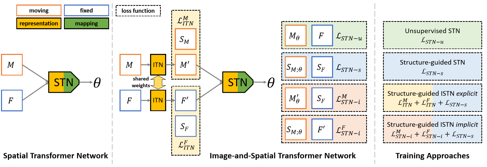

# ISTN


[_Image-and-Spatial Transformer Networks for Structure-guided Image Registration_](http://arxiv.org/abs/1907.09200)

> We introduce a novel, generic, learning-based image registration framework, Image-and-Spatial Transformer Networks, to leverage Structures-of-Interest information allowing us to learn new image representations that are optimised for the downstream registration task. Thanks to these representations we can employ a test-specific, iterative refinement over the transformation parameters which yields highly accurate registration even with very limited training data.

The work has been accepted at MICCAI 2019. If you make use of the code, please cite the paper in any resulting publications:
```
@inproceedings{lee2019istn,
    author = {Lee, Matthew C.H. and Oktay, Ozan and Schuh, Andreas and Schaap, Michiel and Glocker, Ben},
    title = {Image-and-Spatial Transformer Networks for Structure-guided Image Registration},
    year = {2019},
    booktitle = {International Conference on Medical Image Computing and Computer Assisted Intervention (MICCAI)}
}
```

## Setup

To install requirements run

`pip install -r requirements.txt`

## Demo with 2D synthetic data

### Data
To unzip the 2D synthetic data used in the paper, from the parent directory run

`unzip data/synth2d/unzip_here.zip -d data/synth2d/`

### Running ISTNs
To run a 2D experirment with an implicit ISTN on the synthetic data run

`python istn-reg.py --config data/synth2d/config.json --transformation affine --loss i --out output/istn-i --model output/istn-i/train/model`

`--loss` controls the type of training strategy as described in the paper, options are

`u` - unsupervised
`s` - supervised
`e` - explicit
`i` - implicit

### Monitoring Training with Tensorboard
Tensorboard logs are placed in `{{--out}}/tensorboard`, to fire up tensorboard you can run

`tensorboard --logdir {{--out}}`

If you installed tensoboard using pip, you may not be able to call it as above as. You can find its installation location by running

`pip show tensoboard`

Then you can run 

`python tensorboard/location/main.py --logdir {{--out}}`

Models are saved under `{{--out}}/train`, once training is complete test results are found processed and put into `{{--out}}/test`
